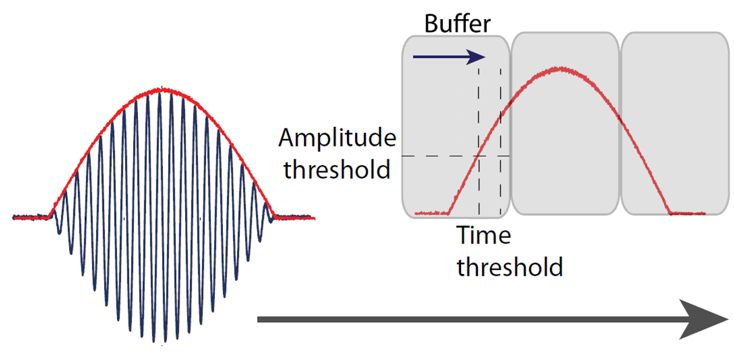
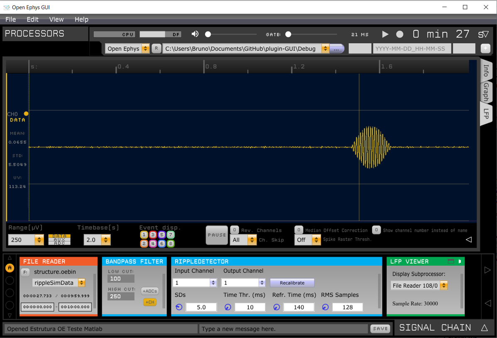
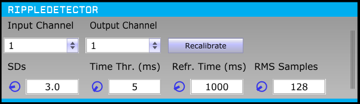

# Ripple Detector - Open Ephys Plugin
Open Ephys plugin to detect hippocampal ripple events.

## Installation
First, you will have to download the Open Ephys (OE) GUI source code and compile it (https://open-ephys.github.io/gui-docs/Developer-Guide/Compiling-the-GUI.html). The second step is to create the build files for the plugin and compile it. Again, the official OE website provides all the instructions (https://open-ephys.github.io/gui-docs/Developer-Guide/Compiling-plugins.html). For those using Windows 10, I wrote my own instructions for compiling the OE GUI and the RippleDetector plugin using Visual Studio 2019 Community. You will find these instructions in the "How to install OE and RippleDetector from source code - Win10_VS.pdf" file. Hope it helps!  

## Ripple detection algorithm
The ripple detection algorithm works in two steps:
- Calibration: this is the initial stage when the threshold for ripple detection is calculated. Each data buffer is divided into blocks containing N samples, where N is the "RMS Samples" value set in the plugin's GUI. The RMS value of each block is calculated for the first 1000 data buffers, so we have a total of (bufferSize / N * 1000) RMS values. The mean and standard deviation (standardDeviation) for the RMS values are obtained and we have the final detection threshold (detectionThreshold) as:

      detectionThreshold = mean + "SDs" * standardDeviation

   where "SDs" is a parameter set in the plugin's GUI.

- Detection: this is when ripples are being identified online. The RMS value of each block inside the buffer is calculated and tested against the amplitude threshold. If this value is kept above the amplitude threshold for the time window defined in the parameter "Time Threshold", ripple events are generated. After the event generation, the refractory period starts and new ripple events are detected only after this time window ends. This is the "Refractory Time" parameter, also adjustable in the plugin's GUI.

Visual summary of the algorithm:

## Usage
- Use this plugin after a Bandpass Filter module, filtering the signal in the ripple frequency band;
- Use this plugin before a sink module (LFP Viewer or Pulse Pal, for instance).
- Note: the parameters for the best ripple detection scenario may vary from animal to animal. We recommend that you perform a first recording session and adjust the parameters using the File Reader source node with the recorded data.

Here is a screenshot of the module being used with simulated data (you will find these data in the folder "Simulation Data"):

## Plugin's GUI and parameters set by the user

- Input channel: the number of the input channel from which ripple data will be processed;
- Output channel: the number of the output channel where detection events are marked;
- SDs: number of standard deviations above the average to compose the amplitude threshold;
- Time Threshold (ms): the RMS value must be above the amplitude threshold for a minimum of X milliseconds to detect a ripple. X is the value this parameter represents; 
- Refractory Time (ms): represents a time window just after ripple detection in which new ripples are unable to be detected;
- RMS Samples: number of samples inside each buffer sub-block to calculate the RMS value.

- Button "Recalibrate": starts the calibration process again, calculating a new amplitude threshold;

