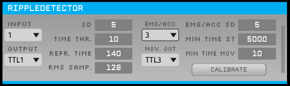

# Ripple Detector - Plugin for Open Ephys
Open Ephys plugin for ripple detection.

## Installation
First, you will have to download the Open Ephys (OE) GUI source code and compile it (https://open-ephys.github.io/gui-docs/Developer-Guide/Compiling-the-GUI.html). The second step is to create the build files for the plugin and compile it. Again, the official OE website provides all the necessary instructions (https://open-ephys.github.io/gui-docs/Developer-Guide/Compiling-plugins.html). For those using Windows 10, I wrote my own instructions for compiling the OE GUI and the RippleDetector plugin using Visual Studio 2019 Community. You will find these instructions in the "How to install OE and RippleDetector from source code - Win10_VS.pdf" file. Hope it helps!  

## Usage
- Use this plugin after a Bandpass Filter module, filtering the signal in the ripple frequency band;
- Use this plugin before a sink module (LFP Viewer, Recording Node or Pulse Pal, for instance).
- Note: the parameters for the best ripple detection performance may vary according to the recording setup, noise level, electrode type, implant quality, and even from animal to animal. We recommend that you perform a first recording session and to find the optimal parameters using the File Reader source node with the recorded data.

Below is a screenshot of the module being used with real data (hc-18 dataset available at CRCNS.org – Drieu, Todorova and Zugaro, 2018a; Drieu, Todorova and Zugaro, 2018b). We also created synthetic ripple data to perform preliminary tests of the plugin (you will find these data in the folder "Simulation Data").

## Plugin's GUI and parameters set by the user

- Input channel: the number of the input channel from which ripple data will be processed;
- Output channel: the number of the output channel where detection events are marked;
- SDs: number of standard deviations above the average to compose the amplitude threshold;
- Time Threshold (ms): the RMS value must be above the amplitude threshold for a minimum of X milliseconds to detect a ripple. X is the value this parameter represents; 
- Refractory Time (ms): represents a time window just after ripple detection in which new ripples are unable to be detected;
- RMS Samples: number of samples inside each buffer sub-block to calculate the RMS value.

- Button "Recalibrate": starts the calibration process again, calculating a new amplitude threshold;

## Ripple detection algorithm
The ripple detection algorithm works in two steps:
- Calibration: this is the initial stage when the threshold for ripple detection is calculated. The calibration period corresponds to the first 20 seconds of recording. During this period, the incoming filtered data in the ripple frequency band is divided into blocks of N samples, where N is the "RMS Samples" value set in the plugin's GUI. The RMS value is calculated for each block, so we have a total of (20 * sampleRate / N) RMS points. The RMS mean and standard deviation (standardDeviation) for the whole calibration period are calculated and we have the final amplitude threshold (amplitudeThreshold) specified in terms of standard deviations above the mean:

      amplitudeThreshold = RMS_mean + "SDS" * RMS_standardDeviation

   where "SDS" is the number of standard deviations above the mean. This parameter can be set in the plugin's GUI.

- Detection: this is when ripples are identified online. The RMS value of each block is calculated and tested against the amplitude threshold. If this value is kept above the amplitude threshold for the time window defined by the parameter "Time Threshold", ripple events are generated. After an event is raised, the detection of new ripple events is blocked for "Refractory Time" milliseconds. This parameter can be also adjusted in the plugin's GUI.

Visual summary of the algorithm:

## References

Drieu, C., Todorova, R., & Zugaro, M. (2018a). Nested sequences of hippocampal assemblies during behavior support subsequent sleep replay. Science (New York, N.Y.), 362(6415), 675–679. https://doi.org/10.1126/science.aat2952

Drieu, C., Todorova, R., & Zugaro, M. (2018b). Bilateral recordings from dorsal hippocampal area CA1 from rats transported on a model train and sleeping. CRCNS.org. http://dx.doi.org/10.6080/K0Z899MM.

