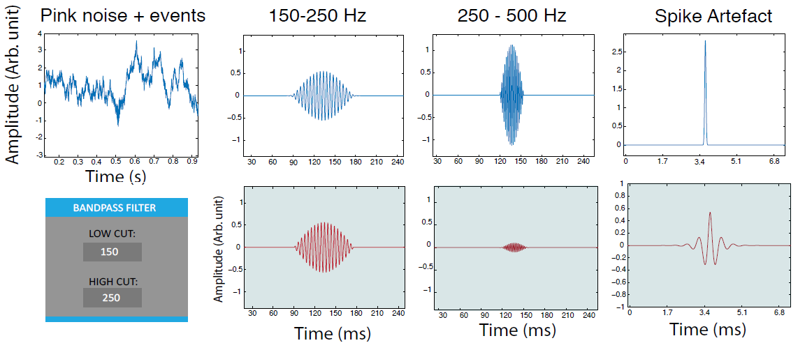

## Simulation data
Ripples_Simulation.kwd includes simulation data to test the ripple detection plugin. Data are composed by pink noise in the background and three more kinds of events: ripples, fast ripples and spike artefacts. Events happen in a randomized order with a fixed interval between them. 
- Ripples: events in the 150Hz-250Hz frequency band;
- Fast ripples: events in the 250Hz-500Hz frequency band;
- Spike artefacts: sudden peaks with low duration and high amplitude.

