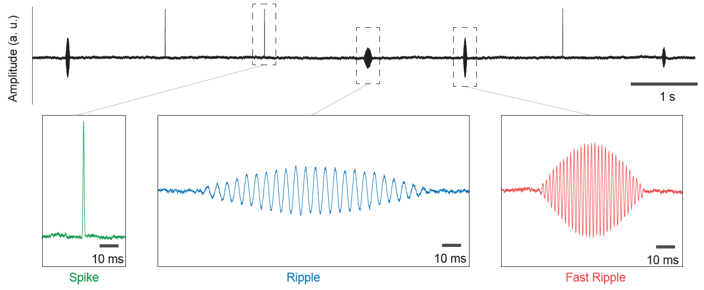
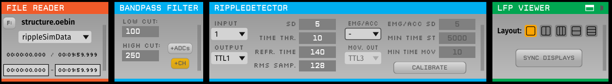

## Simulation data
The file continuous.dat in the directory "continuous/rippleSimData/" includes simulation data to test the ripple detection plugin. Data are composed by pink noise in the background and three kinds of events: ripples, fast ripples and spike artefacts. Events occur randomly every 1.5 second with a likelyhood of 33% each.

- Ripples: events in the 150Hz-250Hz frequency band;
- Fast ripples: events in the 250Hz-500Hz frequency band;
- Spike artefacts: sudden peaks with low duration and high amplitude.

## How to use it
Open the simData.oebin file in the File Reader module and, after that, make sure that "rippleSimData" is selected in the dropdown menu. Don't forget to keep the "continuous" folder and all of its components in the same directory of the simData.oebin file. An example of how to use it:

## References for the synthetic data

OLIVEIRA, E. F.; FERNÁNDEZ RUIZ, A. ; BERALDO, I. J. D. ; BECKER, G. F. ; SILVA, R. B. D. ; SORIANO, D. C. ; BUZSAKI, G. ; LOPES-AGUIAR, C. . Improved ripple detection for real-time and closed-loop manipulation of memory in neural systems. In: Society for Neuroscience Meeting, 2018, San Diego. Society for Neuroscience Meeting, 2018.

LOPES-AGUIAR, C.; OLIVEIRA, E.F.; ZACHARIAS, L.R; PERES, L.B.; DIBA, K., SORIANO, D.C.; LEITE, J.P. Validation and biological relevance of a real-time ripple detection module for open-ephys. Poster presentation: Society for Neuroscience Annual Meeting, 2016 – San Diego, USA.
